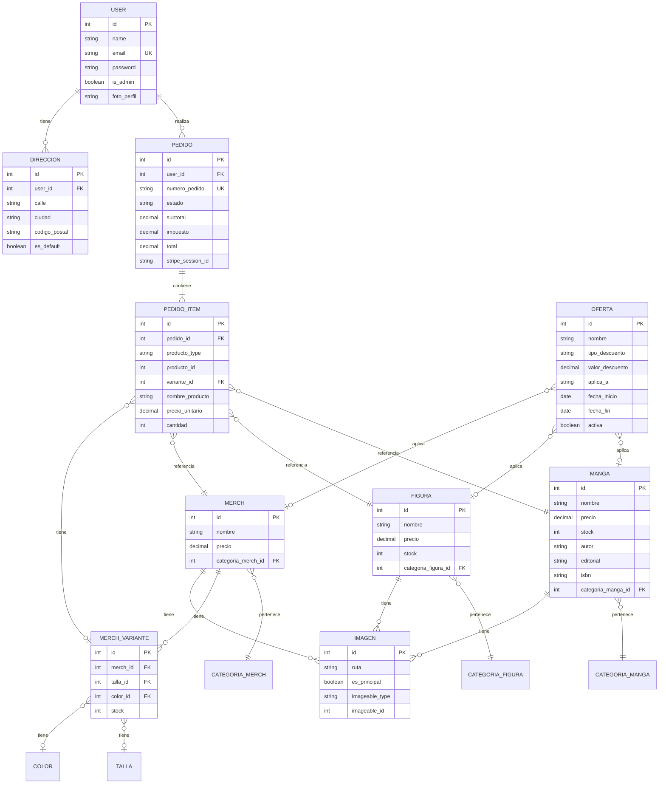
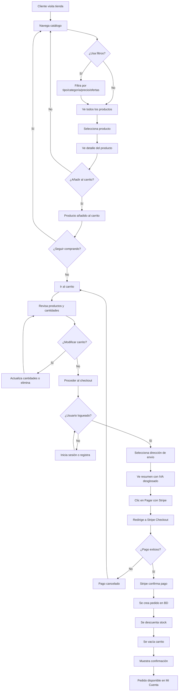
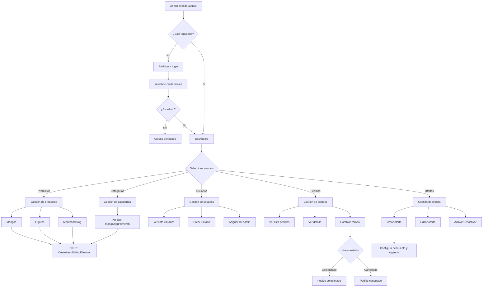

# MangUP - Tienda Online de Manga y Anime

Ecommerce desarrollado con **Laravel 11** para la venta de manga, figuras coleccionables y merchandising anime. Incluye pasarela de pago **Stripe** y panel de administración completo.

> La aplicación Laravel se encuentra en la carpeta `tienda/`. Todos los comandos deben ejecutarse desde ahí.

---

## Características

### Tienda (Cliente)
- Catálogo con filtros por tipo (manga, figura, merch), categoría, precio y ofertas
- Sistema de ofertas con descuentos porcentuales o cantidad fija
- Carrito de compras con sesión persistente
- Checkout con Stripe (tarjetas de crédito)
- IVA 21% incluido en precios
- Cuenta de usuario: datos personales, direcciones, historial de pedidos

### Panel de Administración
- **Dashboard** con estadísticas de ventas
- **Productos**: CRUD completo de mangas, figuras y merchandising
- **Categorías**: gestión por tipo de producto
- **Usuarios**: crear, editar, asignar rol administrador
- **Pedidos**: listado, detalle y cambio de estado (pendiente → completado)
- **Ofertas**: crear descuentos por porcentaje o cantidad fija, aplicables a todos los productos, por tipo o producto específico

---

## Requisitos

- PHP >= 8.2
- Composer
- MySQL >= 8.0
- Node.js >= 18

### Extensiones PHP
`openssl`, `pdo_mysql`, `mbstring`, `curl`, `fileinfo`, `xml`, `ctype`, `json`

---

## Instalación

```bash
# Clonar y entrar al proyecto
git clone https://github.com/lkmark956/MangUP.git
cd MangUP/tienda

# Instalar dependencias
composer install
npm install

# Configurar entorno
copy .env.example .env   # Windows
cp .env.example .env     # Linux/Mac
php artisan key:generate

# Configurar base de datos en MySQL
# CREATE DATABASE mangup_db;

# Editar .env con credenciales de MySQL y Stripe

# Migrar y sembrar datos
php artisan migrate --seed

# Enlace de storage y compilar assets
php artisan storage:link
npm run build

# Iniciar servidor
php artisan serve
```

Accede a: http://localhost:8000

---

## Configuración de Stripe

1. Regístrate en [stripe.com](https://stripe.com)
2. Ve a [Dashboard > API Keys](https://dashboard.stripe.com/test/apikeys) (modo Test)
3. Copia las claves en `.env`:

```env
STRIPE_KEY=pk_test_tu_clave_publica
STRIPE_SECRET=sk_test_tu_clave_secreta
```

### Tarjeta de prueba
| Campo | Valor |
|-------|-------|
| Número | 4242 4242 4242 4242 |
| Fecha | Cualquier fecha futura |
| CVV | Cualquier 3 dígitos |

---

## Estructura del Proyecto

```
MangUP/
└── tienda/                    # Aplicación Laravel
    ├── app/
    │   ├── Http/Controllers/
    │   │   ├── Admin/         # Controladores del panel admin
    │   │   ├── Auth/          # Login y registro
    │   │   ├── CarritoController.php
    │   │   ├── CheckoutController.php
    │   │   └── ProductoController.php
    │   └── Models/            # Modelos Eloquent
    │       ├── Manga.php
    │       ├── Figura.php
    │       ├── Merch.php
    │       ├── Oferta.php
    │       ├── Pedido.php
    │       └── User.php
    ├── database/
    │   ├── migrations/        # Esquema de BD
    │   └── seeders/           # Datos iniciales
    ├── public/                # Assets públicos
    ├── resources/views/       # Vistas Blade
    │   ├── admin/             # Panel administración
    │   ├── carrito/
    │   ├── checkout/
    │   ├── cuenta/
    │   └── productos/
    ├── routes/web.php         # Definición de rutas
    └── .env                   # Variables de entorno
```

---

## Usuario Administrador

El seeder crea un usuario admin por defecto:

| Campo | Valor |
|-------|-------|
| Email | admin@mangup.com |
| Password | admin123 |

Acceso al panel: http://localhost:8000/admin

---

## Tecnologías

| Componente | Tecnología |
|------------|------------|
| Backend | Laravel 11 |
| Frontend | Blade + Vite |
| Base de datos | MySQL 8 |
| Pagos | Stripe PHP v19 |
| CSS | Bootstrap 5 |

---

## Rutas Principales

### Públicas
| Ruta | Descripción |
|------|-------------|
| `/` | Página de inicio |
| `/productos` | Catálogo con filtros |
| `/productos/{id}` | Detalle de producto |
| `/carrito` | Ver carrito |
| `/checkout` | Proceso de pago |

### Usuario Autenticado
| Ruta | Descripción |
|------|-------------|
| `/mi-cuenta` | Datos personales |
| `/mi-cuenta/pedidos` | Historial de pedidos |
| `/mi-cuenta/direcciones` | Gestión de direcciones |

### Administración (`/admin`)
| Ruta | Descripción |
|------|-------------|
| `/admin` | Dashboard |
| `/admin/mangas` | CRUD Mangas |
| `/admin/figuras` | CRUD Figuras |
| `/admin/merch` | CRUD Merchandising |
| `/admin/categorias/{tipo}` | Gestión categorías |
| `/admin/usuarios` | Gestión usuarios |
| `/admin/pedidos` | Gestión pedidos |
| `/admin/ofertas` | Gestión ofertas |

---

## Sistema de Ofertas

Las ofertas pueden configurarse desde `/admin/ofertas`:

- **Tipo de descuento**: Porcentaje (%) o cantidad fija (€)
- **Aplicable a**: Todos los productos, solo mangas, solo figuras, solo merch, o un producto específico
- **Vigencia**: Fechas de inicio y fin opcionales
- **Activación**: Pueden activarse/desactivarse

El sistema aplica automáticamente la mejor oferta disponible a cada producto.

---

## Diagrama Entidad-Relación



---

## Diagrama de Flujo - Proceso de Compra



---

## Diagrama de Flujo - Panel de Administración



---

## Licencia

Proyecto educativo - 2º Trimestre Optativa
