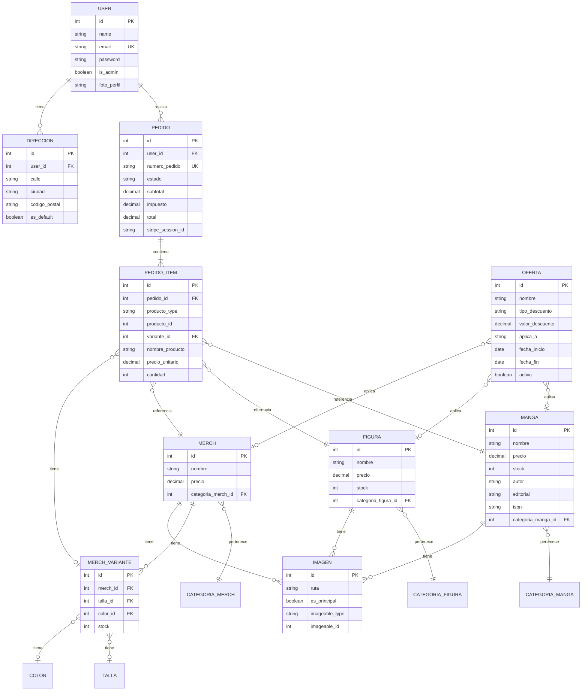
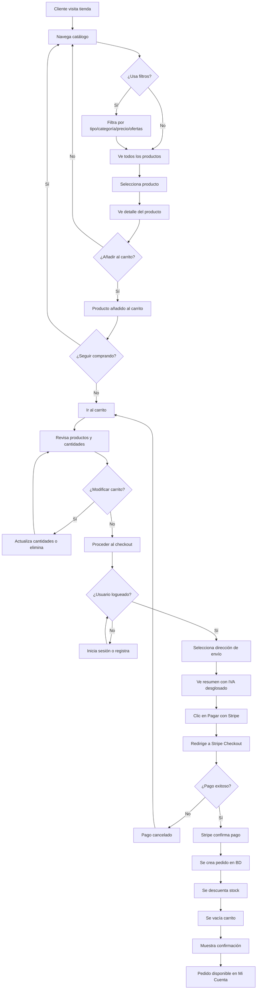
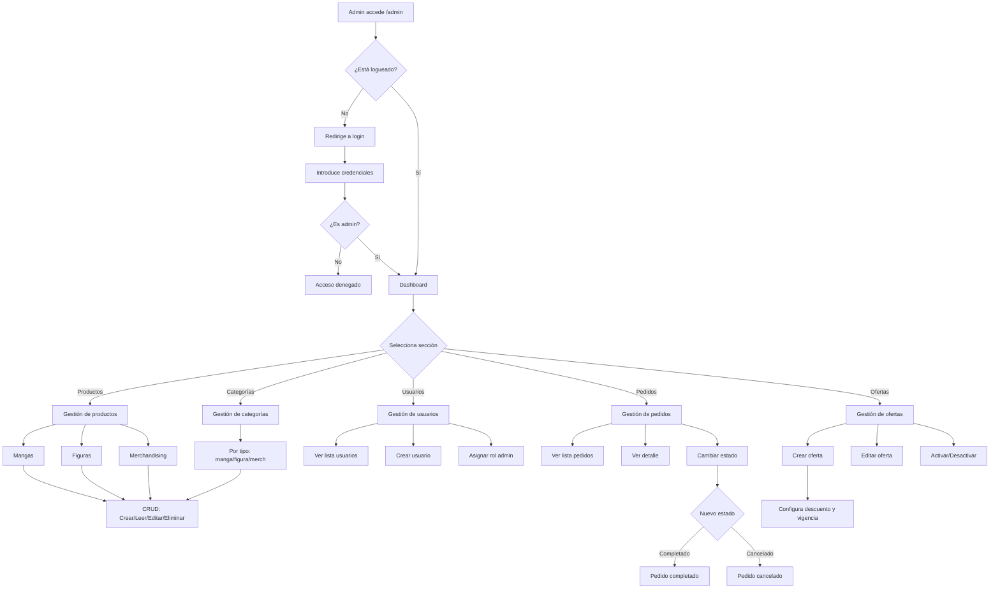

# MangUP - Tienda Online de Manga y Anime

Ecommerce desarrollado con **Laravel 11** para la venta de manga, figuras coleccionables y merchandising anime. Incluye pasarela de pago **Stripe** y panel de administración completo.

> La aplicación Laravel se encuentra en la carpeta `tienda/`. Todos los comandos deben ejecutarse desde ahí.

---

## Características

### Tienda (Cliente)
- Catálogo con filtros por tipo (manga, figura, merch), categoría, precio y ofertas
- Sistema de ofertas con descuentos porcentuales o cantidad fija
- Carrito de compras con sesión persistente
- Checkout con Stripe (tarjetas de crédito)
- IVA 21% incluido en precios
- Cuenta de usuario: datos personales, direcciones, historial de pedidos

### Panel de Administración
- **Dashboard** con estadísticas de ventas
- **Productos**: CRUD completo de mangas, figuras y merchandising
- **Categorías**: gestión por tipo de producto
- **Usuarios**: crear, editar, asignar rol administrador
- **Pedidos**: listado, detalle y cambio de estado (pendiente → completado)
- **Ofertas**: crear descuentos por porcentaje o cantidad fija, aplicables a todos los productos, por tipo o producto específico

---

## 🚀 Guía de Instalación Completa

Sigue estos pasos en orden para tener el proyecto funcionando sin errores.

### Paso 1: Clonar el repositorio
```bash
git clone https://github.com/lkmark956/MangUP.git
cd MangUP/tienda
```

### Paso 2: Configurar PHP (IMPORTANTE)

Antes de instalar dependencias, asegúrate de que PHP tiene las extensiones necesarias habilitadas.

**2.1. Localiza tu `php.ini`:**
```bash
php --ini
```
Esto mostrará la ruta, por ejemplo: `C:\php\php.ini` o `/etc/php/8.x/cli/php.ini`

**2.2. Edita el archivo `php.ini` y habilita estas extensiones:**

Busca cada línea y quita el `;` del inicio:
```ini
extension=curl
extension=zip
extension=openssl
extension=pdo_mysql
extension=mbstring
extension=fileinfo
```

**2.3. Guarda el archivo y verifica:**
```bash
# Windows PowerShell
php -m | Select-String "curl|zip|openssl|pdo_mysql|mbstring|fileinfo"

# Linux/Mac
php -m | grep -E "curl|zip|openssl|pdo_mysql|mbstring|fileinfo"
```
Debes ver las 6 extensiones listadas.

### Paso 3: Instalar dependencias
```bash
composer install
npm install
```

### Paso 4: Configurar entorno
```bash
# Windows
copy .env.example .env

# Linux/Mac
cp .env.example .env

# Generar clave de aplicación
php artisan key:generate
```

### Paso 5: Configurar base de datos

**5.1. Crea la base de datos en MySQL:**
```sql
CREATE DATABASE mangup_db CHARACTER SET utf8mb4 COLLATE utf8mb4_unicode_ci;
```

**5.2. Edita `.env` con tus credenciales:**
```env
DB_CONNECTION=mysql
DB_HOST=127.0.0.1
DB_PORT=3306
DB_DATABASE=mangup_db
DB_USERNAME=root
DB_PASSWORD=tu_contraseña
```

### Paso 6: Configurar Stripe (pagos)

Edita `.env` y añade las claves de Stripe (puedes usar estas de prueba):
```env
STRIPE_KEY=pk_test_51SwlqZJGgdOsjWc0lbv1UUT42nj51OCoiV0dDqhbCOtiA7n0Q71gpe2mYd2O80q1VoZ8c88qmlt5s1AsPirUHNmi00y5KdFbLb
STRIPE_SECRET=sk_test_51SwlqZJGgdOsjWc0fcWJ53BwHnFlYRO3oV1zyv4iS9X5cqCwYP0WGEbpK5saTweq9dgNAluXe2xAAtu8JScI2zA100htbR04LH
```

### Paso 7: Ejecutar migraciones y sembrar datos
```bash
php artisan migrate --seed
```

### Paso 8: Preparar assets
```bash
php artisan storage:link
npm run build
```

### Paso 9: Iniciar el servidor
```bash
php artisan serve
```

### ✅ ¡Listo!

- **Tienda:** http://localhost:8000
- **Panel Admin:** http://localhost:8000/admin
  - Email: `admin@mangup.com`
  - Password: `admin123`

### Tarjeta de prueba para pagos
| Campo | Valor |
|-------|-------|
| Número | 4242 4242 4242 4242 |
| Fecha | Cualquier fecha futura |
| CVV | Cualquier 3 dígitos |

---

## Requisitos del Sistema

- PHP 8.2 - 8.5
- Composer 2.x
- MySQL >= 8.0
- Node.js >= 18

### Extensiones PHP Necesarias

| Extensión | Uso |
|-----------|-----|
| `curl` | Comunicación con Stripe API |
| `zip` | Instalación de dependencias |
| `openssl` | Encriptación |
| `pdo_mysql` | Conexión a MySQL |
| `mbstring` | Manejo de strings UTF-8 |
| `fileinfo` | Validación de archivos |

### 8. Iniciar servidor
```bash
php artisan serve
```

Accede a: http://localhost:8000

---

## Estructura del Proyecto

```
MangUP/
└── tienda/                    # Aplicación Laravel
    ├── app/
    │   ├── Http/Controllers/
    │   │   ├── Admin/         # Controladores del panel admin
    │   │   ├── Auth/          # Login y registro
    │   │   ├── CarritoController.php
    │   │   ├── CheckoutController.php
    │   │   └── ProductoController.php
    │   └── Models/            # Modelos Eloquent
    │       ├── Manga.php
    │       ├── Figura.php
    │       ├── Merch.php
    │       ├── Oferta.php
    │       ├── Pedido.php
    │       └── User.php
    ├── database/
    │   ├── migrations/        # Esquema de BD
    │   └── seeders/           # Datos iniciales
    ├── public/                # Assets públicos
    ├── resources/views/       # Vistas Blade
    │   ├── admin/             # Panel administración
    │   ├── carrito/
    │   ├── checkout/
    │   ├── cuenta/
    │   └── productos/
    ├── routes/web.php         # Definición de rutas
    └── .env                   # Variables de entorno
```

---

## Usuario Administrador

El seeder crea un usuario admin por defecto:

| Campo | Valor |
|-------|-------|
| Email | admin@mangup.com |
| Password | admin123 |

Acceso al panel: http://localhost:8000/admin

---

## Tecnologías

| Componente | Tecnología |
|------------|------------|
| Backend | Laravel 11 |
| Frontend | Blade + Vite |
| Base de datos | MySQL 8 |
| Pagos | Stripe PHP v19 |
| CSS | Bootstrap 5 |

---

## Rutas Principales

### Públicas
| Ruta | Descripción |
|------|-------------|
| `/` | Página de inicio |
| `/productos` | Catálogo con filtros |
| `/productos/{id}` | Detalle de producto |
| `/carrito` | Ver carrito |
| `/checkout` | Proceso de pago |

### Usuario Autenticado
| Ruta | Descripción |
|------|-------------|
| `/mi-cuenta` | Datos personales |
| `/mi-cuenta/pedidos` | Historial de pedidos |
| `/mi-cuenta/direcciones` | Gestión de direcciones |

### Administración (`/admin`)
| Ruta | Descripción |
|------|-------------|
| `/admin` | Dashboard |
| `/admin/mangas` | CRUD Mangas |
| `/admin/figuras` | CRUD Figuras |
| `/admin/merch` | CRUD Merchandising |
| `/admin/categorias/{tipo}` | Gestión categorías |
| `/admin/usuarios` | Gestión usuarios |
| `/admin/pedidos` | Gestión pedidos |
| `/admin/ofertas` | Gestión ofertas |

---

## Sistema de Ofertas

Las ofertas pueden configurarse desde `/admin/ofertas`:

- **Tipo de descuento**: Porcentaje (%) o cantidad fija (€)
- **Aplicable a**: Todos los productos, solo mangas, solo figuras, solo merch, o un producto específico
- **Vigencia**: Fechas de inicio y fin opcionales
- **Activación**: Pueden activarse/desactivarse

El sistema aplica automáticamente la mejor oferta disponible a cada producto.

---

## Diagrama Entidad-Relación



---

## Diagrama de Flujo - Proceso de Compra



---

## Diagrama de Flujo - Panel de Administración



---

## Solución de Problemas

### Error: Extensiones PHP no habilitadas (curl, zip)

**Error:**
```
stripe/stripe-php requires ext-curl * -> it is missing from your system
The zip extension and unzip/7z commands are both missing
```

**Solución:**
1. Localiza tu archivo `php.ini`:
   ```bash
   php --ini
   ```
2. Abre el archivo y habilita las extensiones quitando el `;`:
   ```ini
   extension=curl
   extension=zip
   ```
3. Guarda y verifica:
   ```bash
   php -m | Select-String "curl|zip"   # Windows PowerShell
   php -m | grep -E "curl|zip"         # Linux/Mac
   ```

---

### Error: "Call to undefined function curl_version()" al pagar

**Error:**
```
Call to undefined function curl_version()
Unexpected token '<', "<!DOCTYPE "... is not valid JSON
```

**Causa:** Habilitaste la extensión `curl` pero el servidor PHP no se reinició.

**Solución:**
1. Detén el servidor (Ctrl+C en la terminal donde ejecutaste `php artisan serve`)
2. Reinicia el servidor:
   ```bash
   php artisan serve
   ```
3. Si usas XAMPP/WAMP/Laragon, reinicia Apache desde el panel de control

---

### Error: PDO::MYSQL_ATTR_SSL_CA deprecado (PHP 8.5+)

**Error:**
```
Deprecated: Constant PDO::MYSQL_ATTR_SSL_CA is deprecated since 8.5
```

**Causa:** PHP 8.5 marca esta constante como deprecada. Laravel 11.x aún la utiliza.

**Solución:** El proyecto ya incluye la supresión de esta advertencia en `bootstrap/app.php`. Si ves este error, actualiza el repositorio:
```bash
git pull origin main
```

---

### Error: "Failed to open stream" al crear sesión de Stripe

**Error:**
```
include(...stripe/stripe-php/lib/Checkout/Session.php): Failed to open stream
```

**Causa:** La carpeta `vendor` está corrupta.

**Solución:**
```bash
# Eliminar vendor y reinstalar
Remove-Item -Recurse -Force vendor   # Windows
rm -rf vendor                        # Linux/Mac

composer install
```

---

### Error: "Could not open input file: artisan"

**Causa:** No estás en la carpeta correcta.

**Solución:**
```bash
cd tienda
php artisan serve
```

---

## Licencia

Proyecto educativo - 2º Trimestre Optativa
